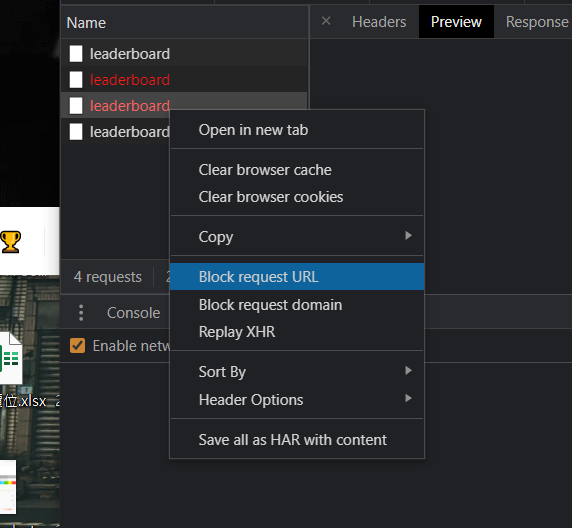
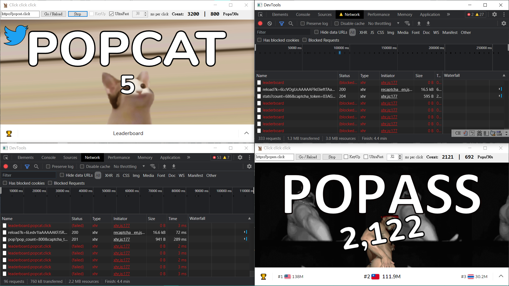
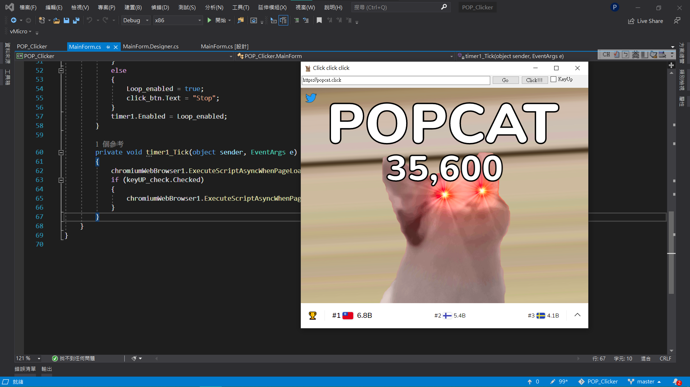
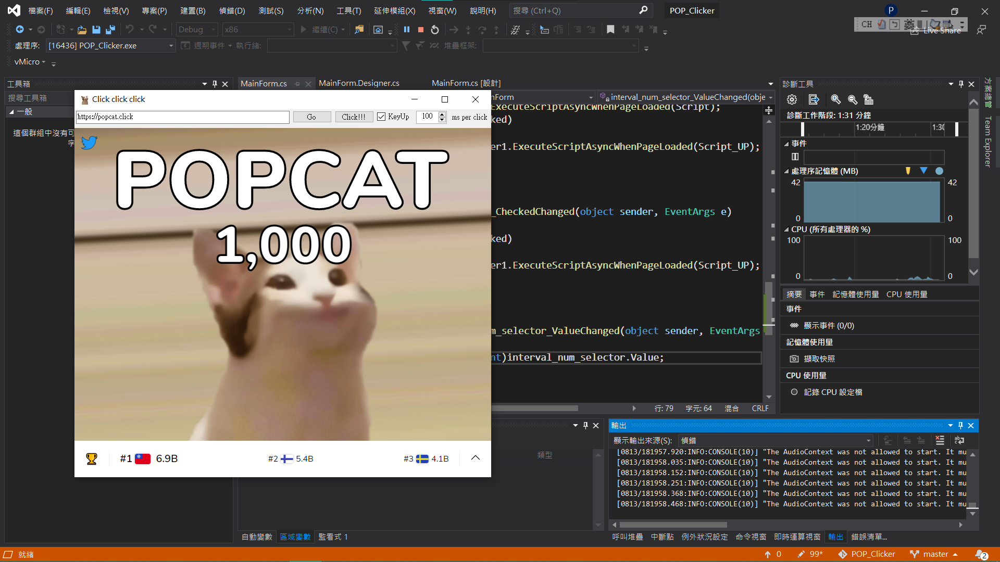
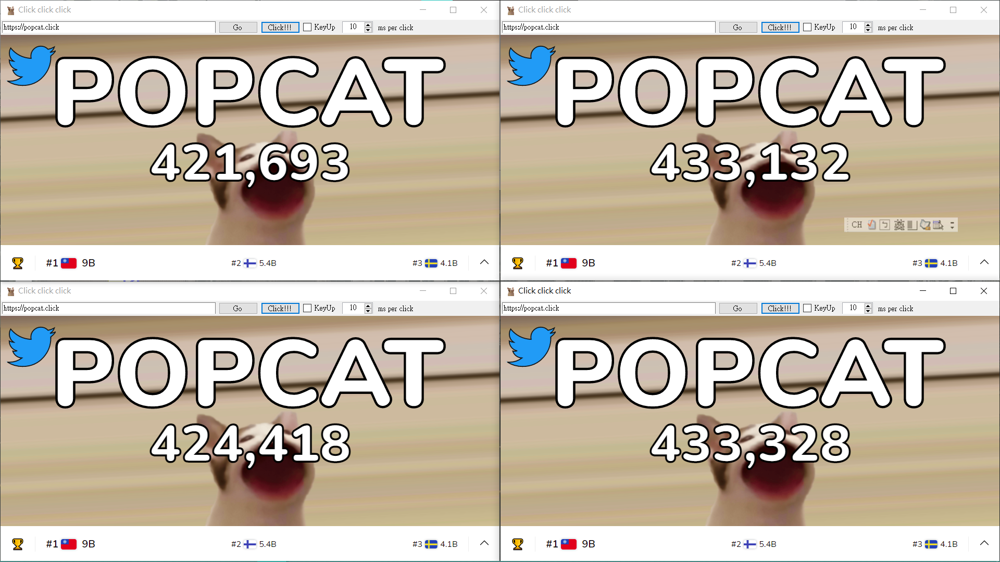
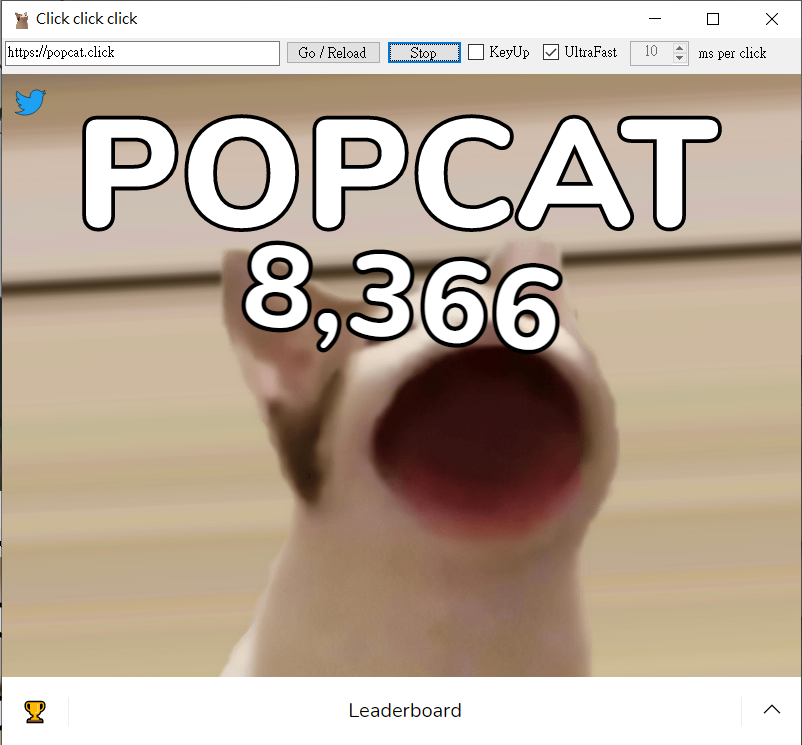

# POPCAT 高速點擊器
程式使用Cefsharp，自帶Google Chrome(Chromium內核)  
  
### 注意：任何暴力點擊模式記得對記分板進行阻擋，以免記分板載入大幅降低執行效率！
(POPCAT網站的擋法)host檔案路徑：  
```
C:\Windows\System32\drivers\etc
```
須加上：  
```
0.0.0.0 leaderboard.popcat.click
```
亦可以使用DEVTOOLS對leaderboard進行Block Content(如底下截圖)  
該方法可以用於POPASS  

  
(v1.6)  

  
* 按下Go載入網頁
* 按下Click!!!開始高速點擊 **(預設38ms一下)** (v1.6)
* 提供全腳本高速點擊模式(v1.6)
* KeyUp勾選欄可以發出KeyUp指令(沒有勾選只有KeyDown)，有了這個指令貓的嘴巴會高速開合(只限暴力點擊的標準模式)
* 調整 ms per click 前面的數字可自己微調(範圍1ms ~ 1000ms，1ms步進)點擊頻率 (V1.1增加)
* 增加紅眼自動重置機制(v1.5 增加，注意：只適用popcat.click)(POPASS紅眼相關變數小弟還抓不到)
* 30秒點擊率估算(監測是否達到紅眼標準：POPCAT：800/30s，POPASS：1000/30s **(可以達到這樣(前幾次會是有效點擊)，不過太多次會被判定Bot，建議還是鎖800)** (v1.6)
* Chromium DEVTOOLS 後台隨時監測資料回傳狀況 **(點擊Count字樣)** (v1.6)
* POPASS亦可適用暴力點擊模式(v1.6 驗證)
* 無法偵測Bot時，在一定週期(約30秒一個)後重置網頁，設定為0可以停用(預設為8)(v1.61增加)
  
(純屬程式練習，大家還是乖乖手點貢獻流量比較好吧...XD)  
  
*注意：源碼不包含CefSharp Nuget Packages，請按照Packages.config底下之資料進行安裝*  
  
## 歷代更新截圖
  
v1.0 截圖：  

  
v1.1 截圖：  

  
v1.3 截圖(增加防作弊機制，可行性還沒驗證)：  
四個實體跑了6個多小時後的狀態  

  
v1.5 截圖：  
* 增加紅眼自動重置機制(發生紅眼會清Cookie重置網頁，等幾秒繼續刷)
* 增加超高速點擊模式
